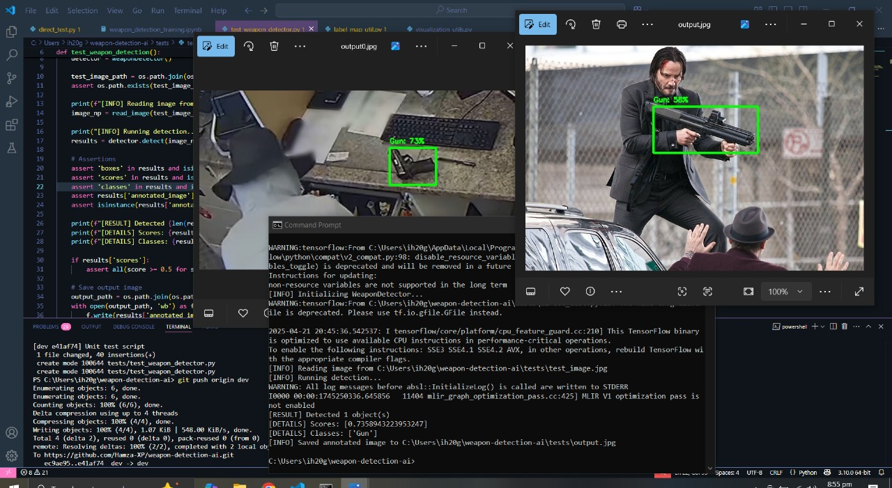

# 🔫 Weapon Detection AI
Weapon detection system using Flask and TensorFlow.

## 🚧 Project Status
**⚠️ This project is currently under development.**  
The system detects weapons (e.g., guns) in realtime CCTV footege and static images using a trained TensorFlow model and displays results through a Flask web interface.

### 📷 Progress Demo: Backend Unit Test Output
  
*Gun detected using a direct unit test inference pipeline with 73% confidence via the Flask-based web interface.*

## 🚀 Installation
- git clone https://github.com/Hamza-XP/weapon-detection-ai.git
- cd weapon-detection-ai
- pip install -r requirements.txt
